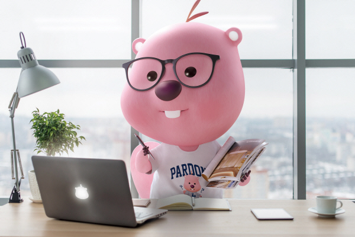
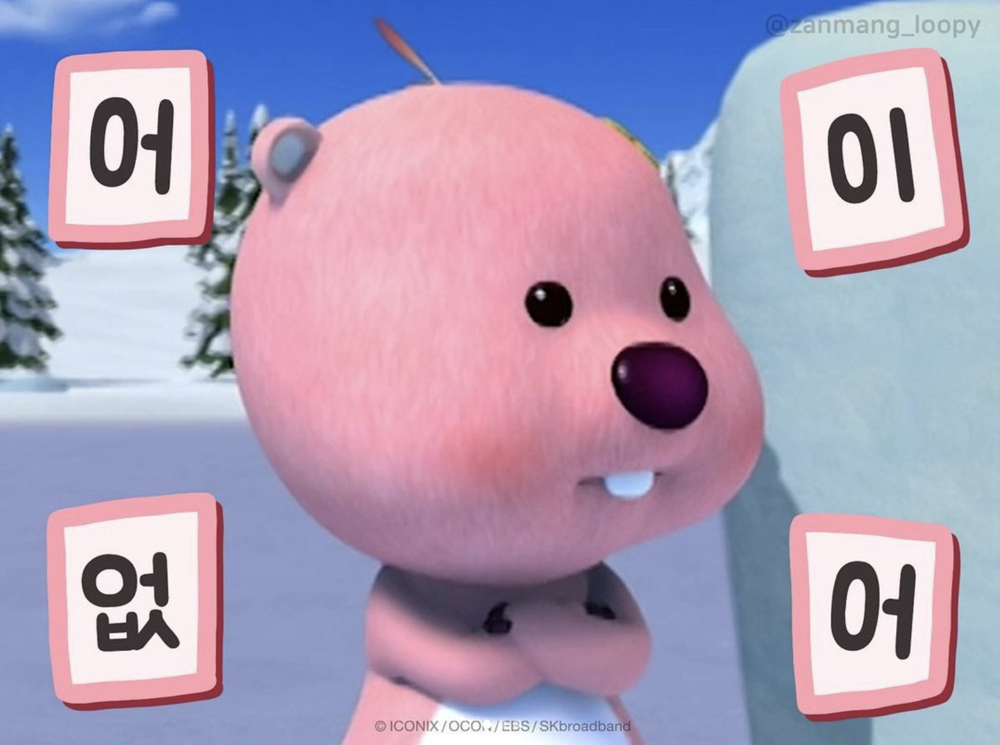

# coding-test-study

## 정통과 컴공이 힘을 합치는 순간

### 코딩테스트를 준비하자.(근엄)

새로운 뉴비들 welcome 👋
2024년에는 코테 마스터를 향해서 다들 화이팅합시다👊🏻

 

 
우리의 코딩테스트 스터디에는 하나의 규칙이 존재합니다. 
사실 규칙이라고 하기에는 제대로 지켜지고 있지 않고 이에 따른 패널티도 없지만 조금이라도 꾸준히를 위해서 만들어진 규칙입니다! 

### 📌 규칙: 밀리면 누적으로 문제풀기.

하루에 3문제 푼다고 했던 arinming은 벌써 약 70문제가 밀린 전적이 있습니다 ㅋㅋ 
새로운 분들은 우리처럼 밀리지 않고 풀 수 있기를 바래요🥲

(프젝 이슈로 돌아온 arinming이 마주한 현실을 깨닫는 순간의 모습)  
